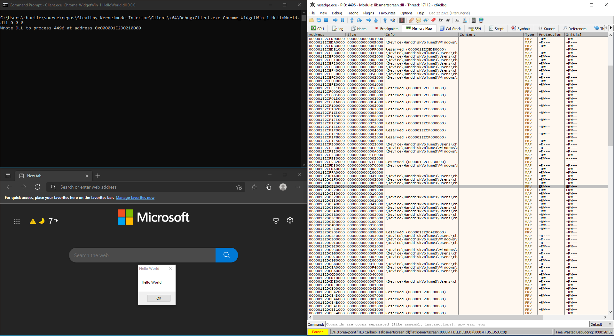
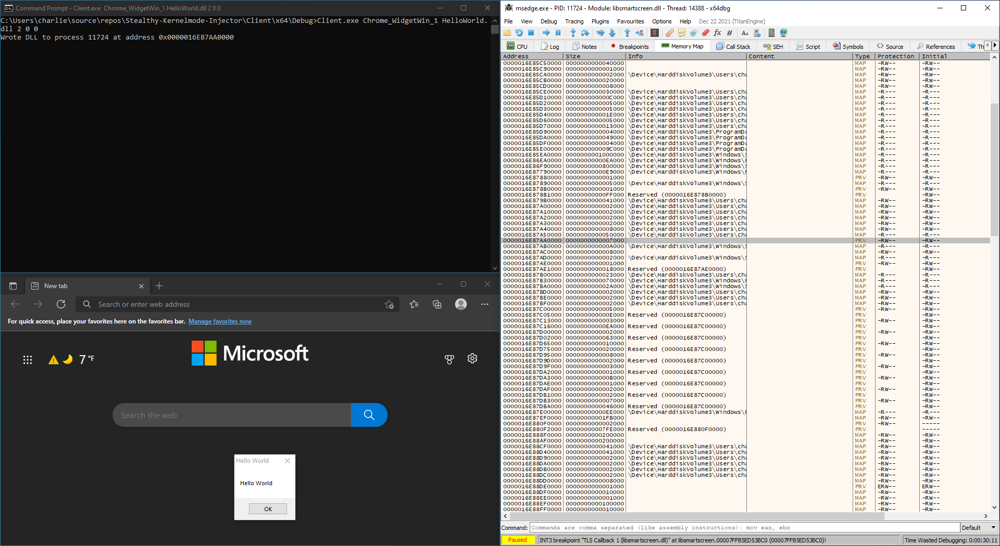
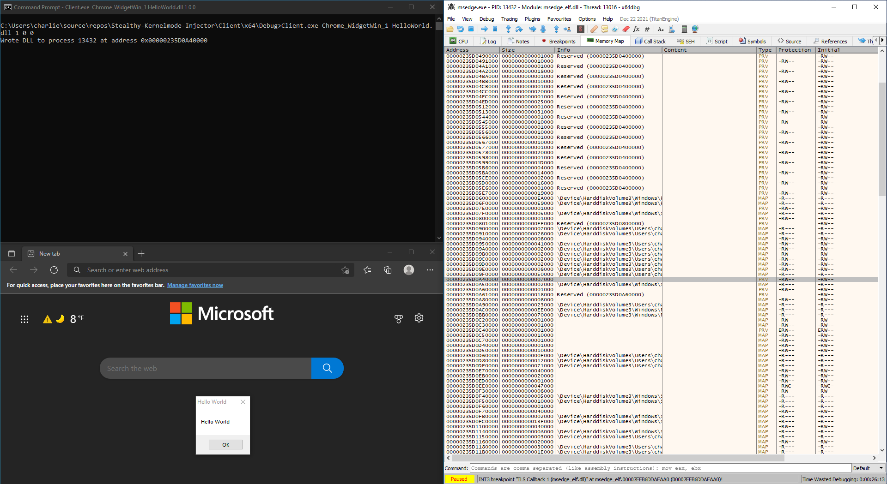
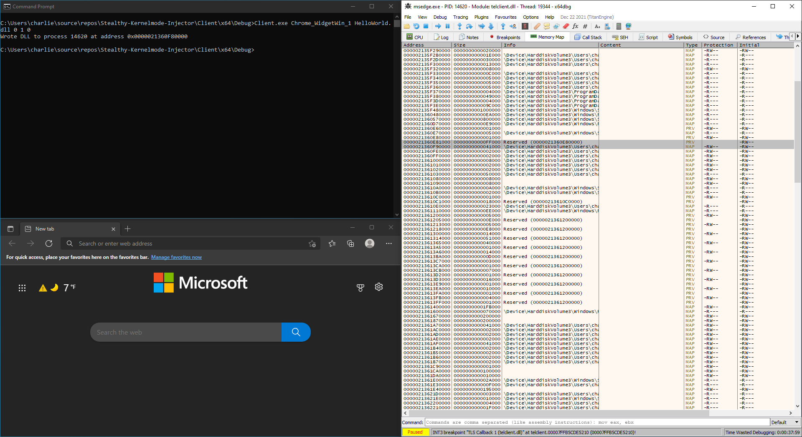
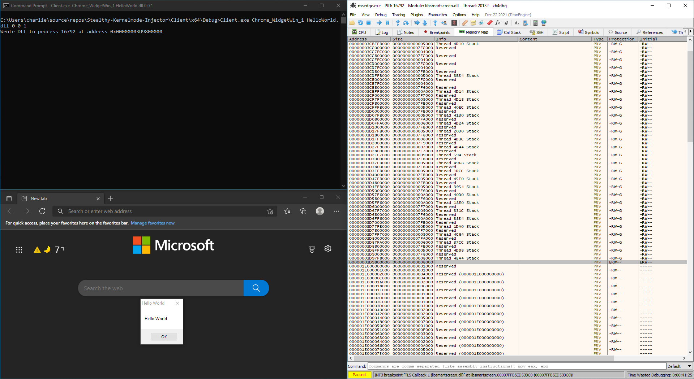

# Stealthy Kernel-mode Injector
Manual mapper that uses PTE manipulation, Virtual Address Descriptor (VAD) manipulation, and forceful memory allocation to hide executable pages.

## Injector
To hide our exectuable pages, the injector supports the following techniques:
- Spoof page protection by modifying PTE execute bit or VAD protection flags
- Remove created VAD entries after allocation
- Forcefully allocate and write our DLL to wherever we want in the process address space

Manipulating the VAD or underlying PTEs is desired in order to spoof page protection from API functions which rely on the VAD such as `NtQueryVirtualMemory`. In the case of this injector, we use VAD and PTE manipulation interchangely as they are both used to fake the protections specified by the VAD.

Rather than "randomly" allocating memory by using an API function such as `NtAllocateVirtualMemory`, forcefully allocating memory via the VAD is used to write our DLL to an "unconventional" location in a processes address space. Anti-tampering solutions using heuristics to detect unwanted executable pages outside signed modules may avoid searching some memory regions to prevent false positives. This injector will allocate memory behind the thread stack.

To execute our DLL, the injector will use `SetWindowsHookEx` to load a valid DLL such as `ntdll.dll`, then use the hook procedure to hijack control flow to call our DLL entry point.

## Driver
Stealthy communication between our user-mode client and kernel-mode driver is achieved by placing a series of PatchGuard safe function hooks inside the windows kernel. An initial hook is placed on a function that is callable from user-mode using a syscall. Then, instead of immediately redirecting execution to our driver, the hook will lead to another function within the same kernel image, which we then hook to be redirected to our driver. 

The reason why we go through this process is to make it difficult to verify the integrity of `ntoskrnl.exe`. Since there are few usable functions inside `ntoskrnl.exe` suitable for communication, a separate driver looking to prevent tampering of `ntoskrnl.exe` could manually verify functions known to be used for user to kernel-mode communication by checking if they lead to an address outside a valid kernel image. However, if we chain hooks within the same kernel image the amount of possible functions an anti-tampering driver would need to verify increases significantly.

The driver is meant to be mapped into the kernel and includes some functionality to hide that a mapper was ever loaded. This includes clearing the PiDDBCacheTable, MmUnloadedDrivers, and g_KernelHashBucketList.

Strings in the driver and user-mode client are encrypted at compile time using skCrypter

## Showcase
The following images show the process memory map of each setting after the DLL is mapped. The memory regions of the mapped DLL are highlighted.

<table><tr>
<td> 
   </br>
   <em>Generic manual mapping with no attempt to hide our DLL</em>
</td>
<td> 
   </br>
   <em>Spoof execution permission using PTE manipulation</em>
</td>
<tr>
<td> 
   </br>
   <em>Spoof execution permission using VAD manipulation</em>
</td>
<td> 
   </br>
   <em>Remove created nodes from VAD tree</em>
</td>
<tr>
<td> 
   </br>
   <em>Forcefully allocate and write DLL behind thread stack</em>
</td>
</tr></table>

## Usage
1. Load the driver
2. Run Client.exe from the command line

```
Usage: Client.exe <Window class name> <DLL> <Spoof page protection> <Remove VAD node> <Allocate behind thread stack>
<Spoof Page Protection>:
	0 - Do not spoof page protection
	1 - Spoof page protection via PTE manipulation
    2 - Spoof page protection via VAD manipulation
<Remove VAD node>:
	0 - Do not remove VAD node
	1 - Remove VAD node
<Allocate behind thread stack>:
	0 - Randomly allocate memory
	1 - Allocate memory behind thread stack
```

## Build
Build using Visual Studio 2019 and the Windows Driver Kit

## Note
The binaries were only tested on Windows 10 21H1

Only supports injection of a x64 DLL into a x64 process

The hooks placed on `ntoskrnl.exe` are not HVCI compatible

## Credits
[Blackbone by DarthTon](https://github.com/DarthTon/Blackbone)

[modmap by btbd](https://github.com/btbd/modmap)

FACE Injector by busybox10

[skCrypter by skadro](https://github.com/skadro-official/skCrypter)

kdmapper by [z175](https://github.com/z175) and [TheCruZ](https://github.com/TheCruZ)